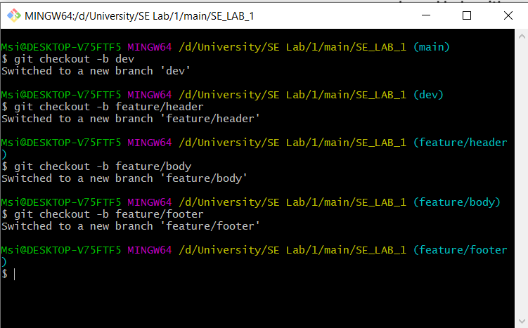
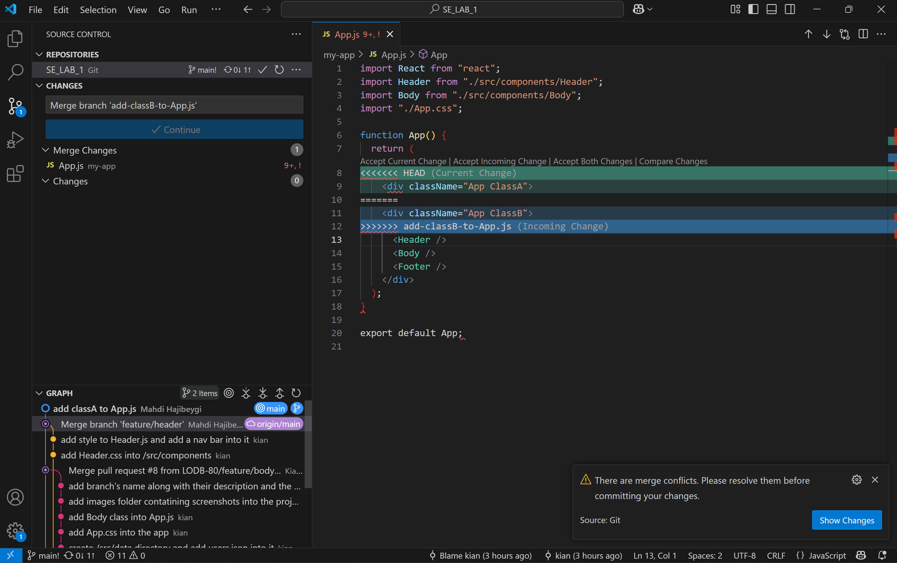
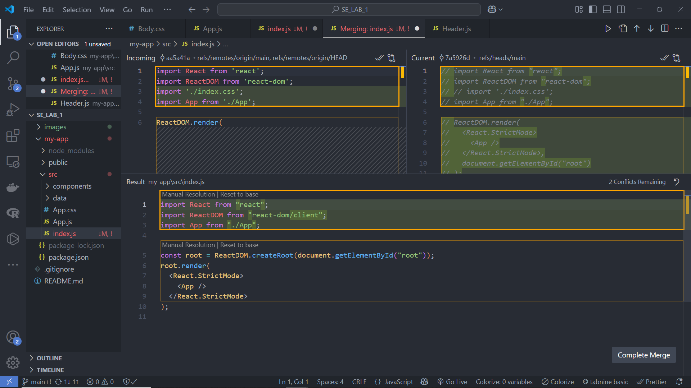

# شرح آزمایش اول درس آزمایشگاه مهندسی نرم افزار

در این آزمایش یک صفحۀ استاتیک برای پیاده سازی در نظر گرفتیم که شامل
سرآیند،بدنه و پانویس است.  
در مرحلۀ بعد تصمیم گرفتیم که 4 شاخۀ دیگر ایجاد کنیم که در تصویر زیر قابل مشاهده هستند:  
  
توضیحات این شاخه ها به شرح زیر است:

- feature/header: این شاخه برای ایجاد و توسعۀ سرآیند در نظر گرفته شده است.
- feature/body: این شاخه برای ایجاد و توسعۀ بدنه در نظر گرفته شده است.
- feature/footer: این شاخه برای توسعه و ایجاد پانویس در نظر گرفته شده است.
- dev: این شاخه نیز برای تغییرات کلی در ساختار برنامه و توسعۀ کلی این صفحه در نظر گرفته شده است که در ادامه سایر شاخه ها با این شاخه ادغام می شوند.

## حل conflict در App.js

در دو شاخۀ ایجاد شده‌ی متفاوت به <App/> کلاس‌های متفاوتی نسبت دادیم که پس از مرج این دو برنچ کانفلیکت پیش آمد.
در نهایت با حذف کلاس‌های کانفلیکت رفع شد.

## کانفلیکت رخ داده برای index.js

حین تغییرات ایجاد شده آدرس فایل تغییر کرده بود که پس از مرج کانفلیکت به وجود آورد.
برای رفع کانفلیکت فایل اضافه پاک شد و ایمپورت‌ها هم در صورت نیاز اصلاح شدند.

## شاخه feature/header

در این شاخه در ابتدا فایل `Header.js` اضافه شده و تغییراتی در آن ایجاد شده است. در مرحلۀ بعد استایل این کلاس در `Header.css` تعریف شده است و در نهایت پوشۀ `/src/data` اضافه شده تا که اطلاعات مورد نیاز در آن ذخیره شود.
البته لینک‌های موجود در header فعال نیستند و به صفحه‌ی اصلی لینک شده‌اند.

## شاخۀ feature/body

در این شاخه در ابتدا فایل `Body.js` اضافه شده و تغییراتی در آن ایجاد شده است. در مرحلۀ بعد استایل این کلاس در `Body.css` تعریف شده است و در نهایت پوشۀ `/src/data` اضافه شده تا که اطلاعات مورد نیاز در آن ذخیره شود. در این پوشه یک فایل به نام `users.json` وجود دارد که شامل اطلاعات اعضای گروه برای نمایش در صفحه است. کامیت های این شاخه به همراه توضیح دقیق هر کامیت در ریپو قابل مشاهده هستند.

## شاخۀ feature/footer

در این شاخه `Footer.js` به همراه استایل آن یعنی `Footer.css` اضافه شدند. در این بخش از صفحه یک آدرس ایمیل به همراه یک شمارۀ تماس نشان داده می شود.

## پاسخ سوالات متداول

#### پوشۀ .git

- پوشۀ .git تمام اطلاعات مربوط به تاریخچۀ کامیت ها، شاخه ها و مخزن محلی گیت است که با دستور `git init` ساخته می شود.

---

#### Atomic بودن در Git

Atomic به معنای انجام کامل یک عملیات بدون امکان تقسیم آن است:

- **Atomic Commit:** ثبت تمام تغییرات به عنوان یک واحد کامل.
- **Atomic Pull-Request:** بررسی و ادغام تمامی تغییرات به صورت یکجا.

---

#### تفاوت `fetch`, `pull`, `merge`, `rebase`, `cherry-pick`

- **`fetch`** → دریافت تغییرات از ریموت بدون ادغام.
- **`pull`** → ترکیب `fetch` و `merge`.
- **`merge`** → ادغام تغییرات دو برنچ.
- **`rebase`** → بازنویسی تاریخچه‌ی کامیت‌ها.
- **`cherry-pick`** → انتخاب و اعمال یک کامیت خاص از یک برنچ دیگر.

---

#### تفاوت `reset`, `revert`, `restore`, `switch`, `checkout`

- **`reset`** → بازنشانی تاریخچه و حالت فایل‌ها.
- **`revert`** → ایجاد کامیت جدید برای بازگرداندن تغییرات.
- **`restore`** → بازگرداندن فایل‌ها به حالت قبلی.
- **`switch`** → تغییر برنچ (جایگزین `checkout` برای برنچ‌ها).
- **`checkout`** → تغییر برنچ یا بازگرداندن فایل‌ها.

---

#### Stage و Stash در Git

- **Stage (Index):** محل ذخیره‌ی موقت تغییرات قبل از کامیت.
- **Stash:** ذخیره‌ی موقت تغییرات بدون کامیت برای تعویض برنچ.

---

#### Snapshot و ارتباط آن با Commit

`Snapshot` یک تصویر لحظه‌ای از وضعیت فایل‌ها در یک زمان خاص است. هر `commit` یک `snapshot` از پروژه را ذخیره می‌کند.

---

#### تفاوت `Local Repository` و `Remote Repository`

- **Local Repository:** روی سیستم محلی ذخیره شده و تغییرات محلی را نگه می‌دارد.
- **Remote Repository:** روی سرور ذخیره شده و برای همکاری تیمی استفاده می‌شود.
